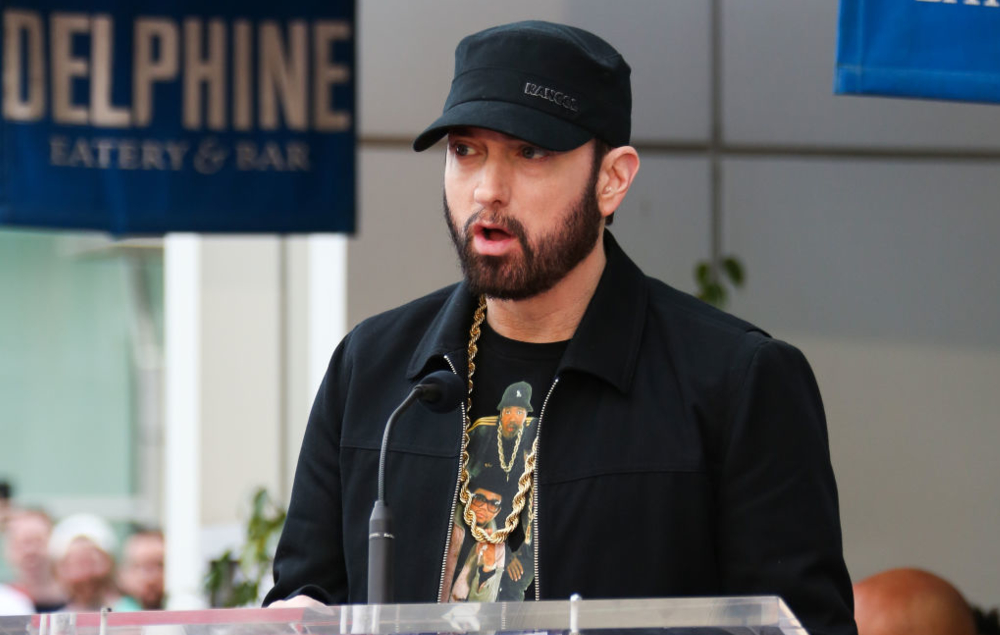
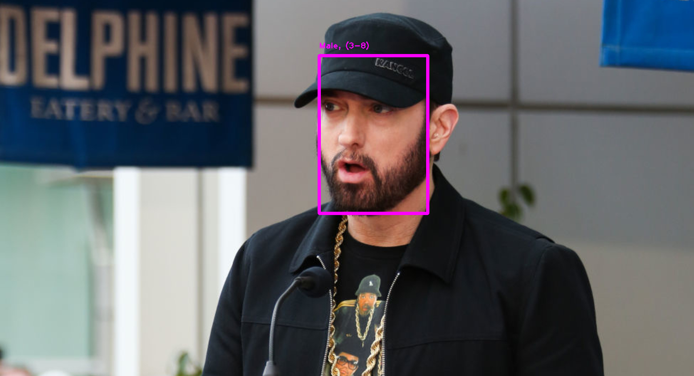
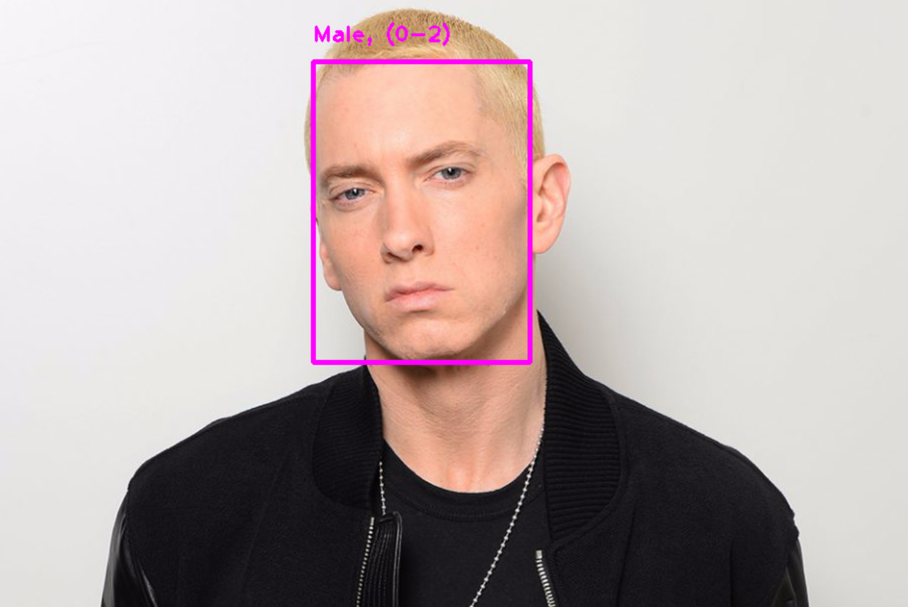
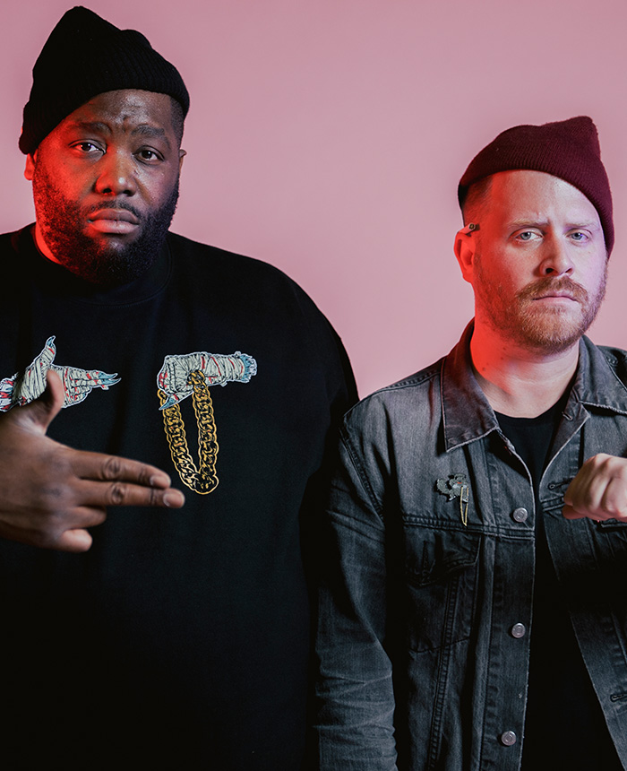
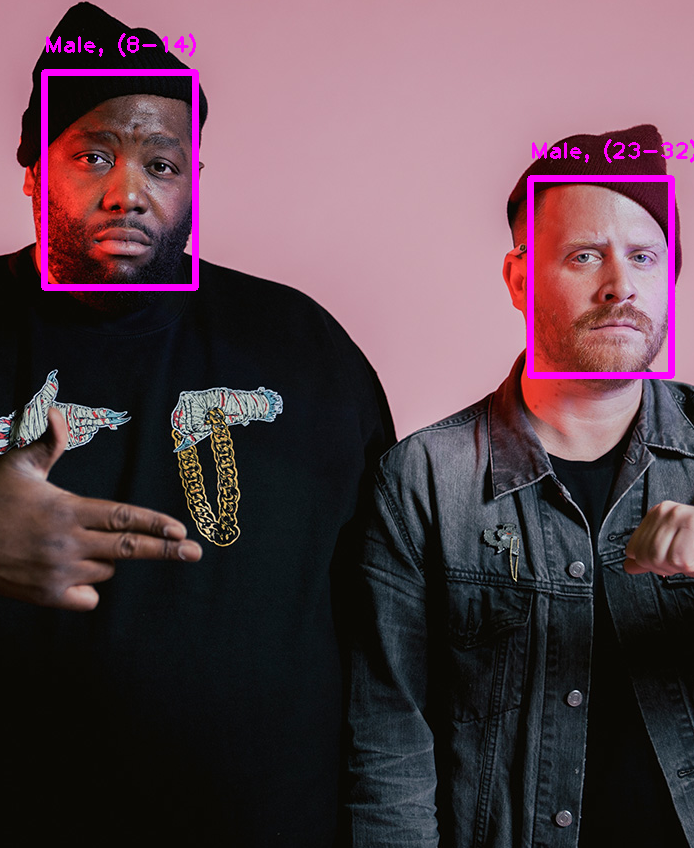
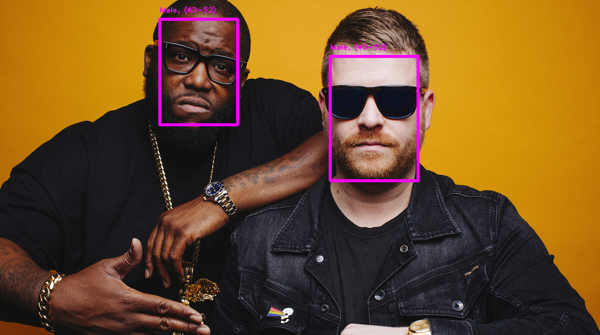

# AgeGenderDetectionPython
An age and gender detection program in Python that I created to learn about the OpenCV Library and Deep Learning

Required Libraries:
- OpenCV (needs to be installed)
- OS (included with python)
- Sys (included with python) 

Library Installation with pip package manager:
- 'pip install opencv-python' to install OpenCV

Contents of Project:
- ageDetect.py  
- files
  - face_detector.pbtxt
  - face_detector_uint8.pb
  - age_deploy.prototxt
  - age_net.caffemodel
  - gender_deploy.prototxt
  - gender_net.caffemodel    
- images
  - JPEGs I ran through the program and PNGs of the outcomes  

The .pb file - protobuf file - holds the models graph definition and trained weights in binary format. The .pbtxt files holds the same type of data in text format. The .prototxt files define the deep network configuration and the .caffemodel files defines the parameters of the different layers. All files are crucial to the program.

Commands:
- 'python ageDetect.py' to see usage cases
- 'python ageDetect.py [path/to/file]' to pass an image into the program
- 'python ageDetect.py camera' to pass camera stream into the program

Comments:
- Billie Eilish

- Grandson  

- Kanye West  

- Logic  

- Macklemore  

- Rich Brian  

- Eminem (Apparently he has a baby face)  

- Run The Jewels (sort of works)  

