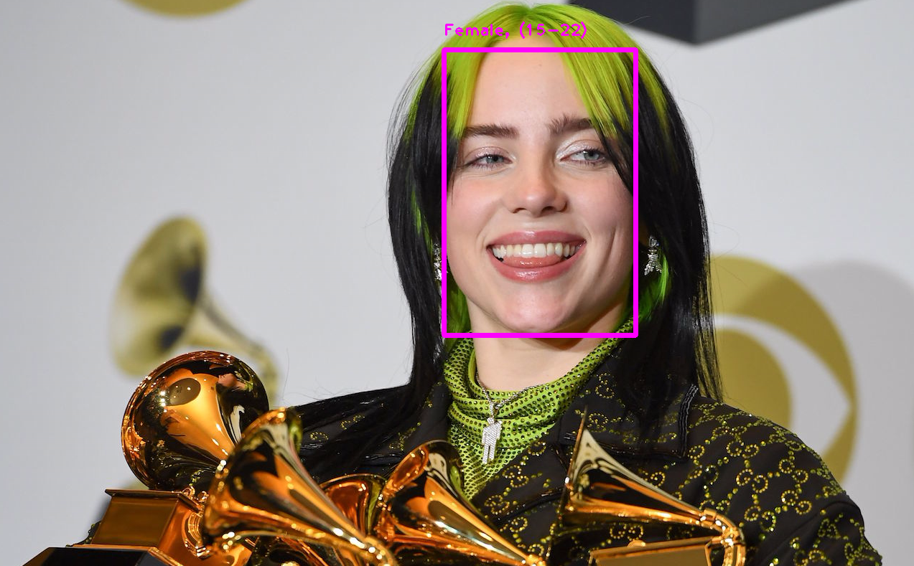
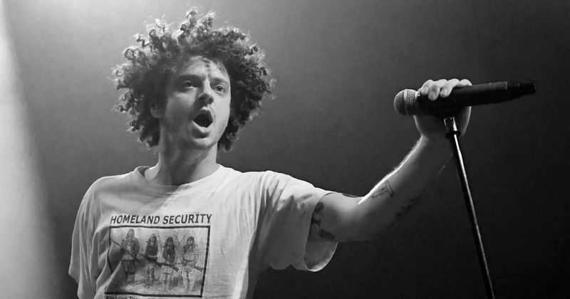
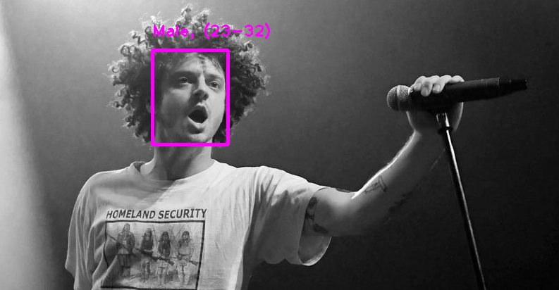
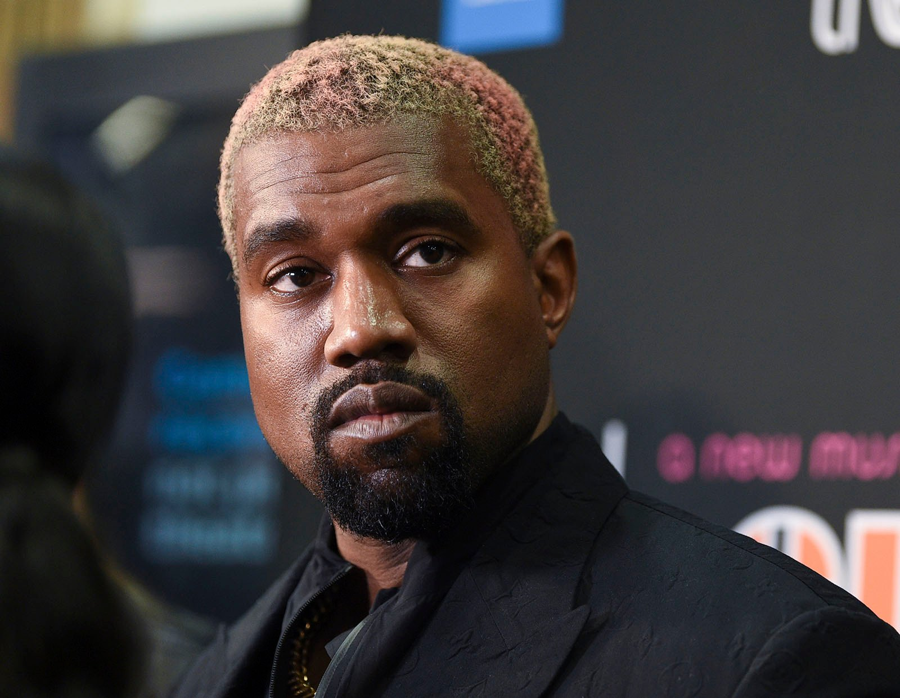
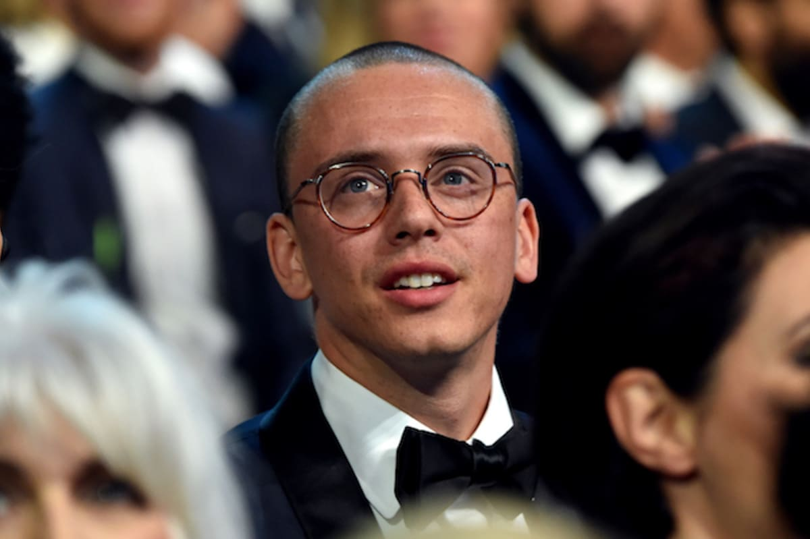
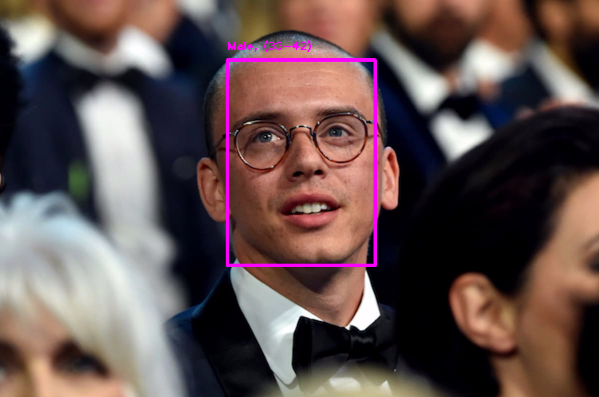
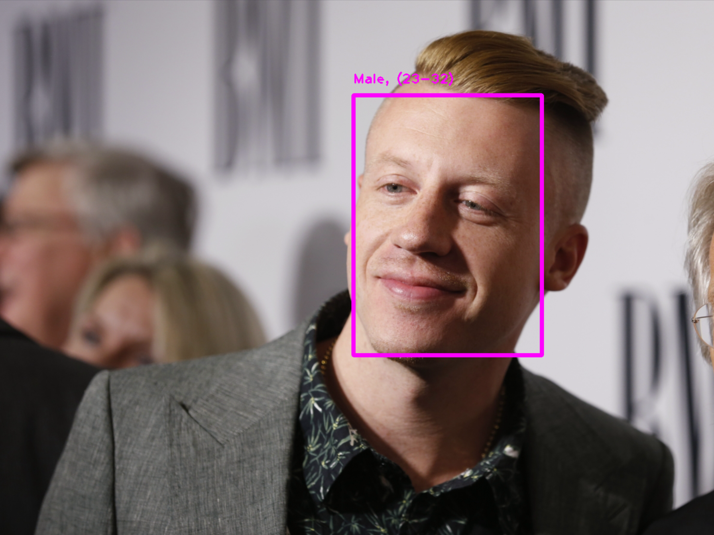
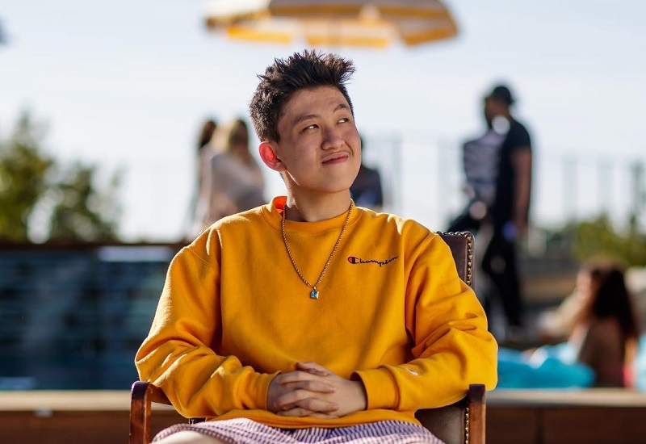
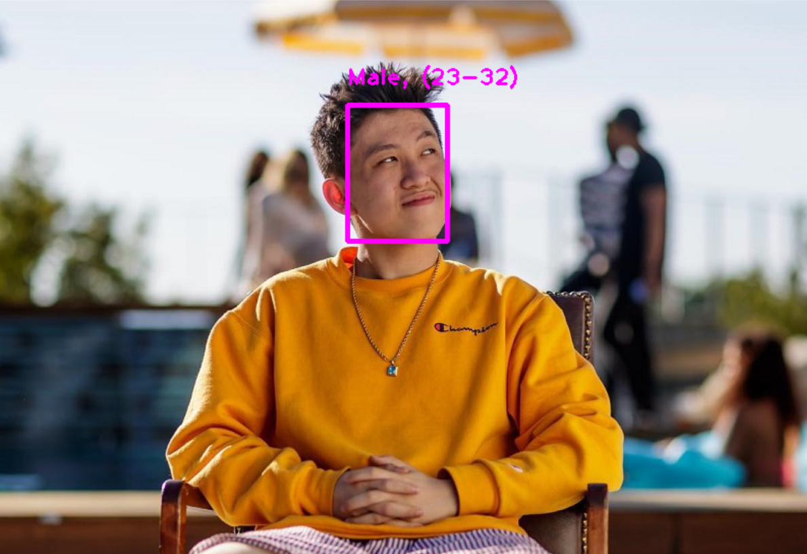

# AgeGenderDetectionPython
An age and gender detection program in Python that I created to learn about the OpenCV Library and Deep Learning

Required Libraries:
- OpenCV (needs to be installed)
- OS (included with python)
- Sys (included with python) 

Library Installation with pip package manager:
- 'pip install opencv-python' to install OpenCV

Commands:
- 'python ageDetect.py' to see usage cases
- 'python ageDetect.py [path/to/file]' to pass an image into the program
- 'python ageDetect.py camera' to pass camera stream into the program

Comments:
- *Mostly* works correctly

- Semi-realistic cartoon charater (Heavy from Team Fortress 2)

- Works with multiple people

- Cannot detect faces if wearing objects around or on face like Hijab or if side profile :(
